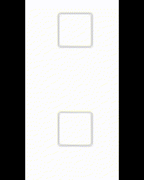
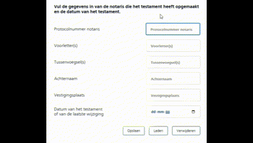
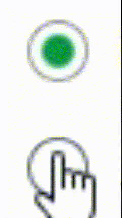
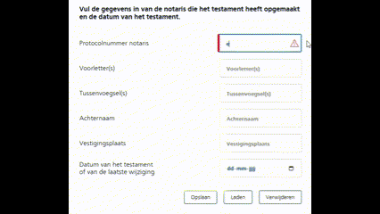
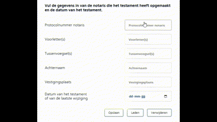

# BrowserTech
BrowserTech - formulieren opdracht

Week#1

Ik ben begonnen met het opzoeken van de huisstijl van NS. Hier heb ik de logo, fonts, kleuren en de UI-elementen gevonden die ze gebruiken.

<a href="https://www.ns.nl/platform/resources.html">NS-huisstijl</a>

Ik ben begonnen met het bouwen van een light en dark mode zodat ik die toegankelijkheid al uit de weg heb. Vervolgens wil ik mij gaan focussen op het maken van de formulier in de html met fieldset. Wanneer dit af is ga ik beginnen aan het stijlen van de formulieren.

Week#2

In week 2 heb ik mij gefocust op de :has selectors.

week#3

In week 3 was ik nog steeds niet blij met mijn design en wist ik ook niet wat ik verder moest doen met de design. Uiteindelijk ben ik opnieuw begonnen met een nieuw strategie. Dit keer ben ik begonnen met het onderzoeken van de stijlen van de buttons, inputs enzovoort. Dit heb ik een voor een gemaakt zodat de styling makkelijker opnieuw gebruikt kunnen worden.

Ik heb nagedacht over de dingen die ik heb gehoord. Vasisli - Begin met de styling. Jeremy - work one problem at a time. Progressive enhancement - Gebruik javascript als laatste.

Zo ben ik stap voor stap overgegaan naar een verbeterde website.

week#4

In week 4 heb ik gekeken naar Javascript componenten en heb ik buttons gemaakt waar je je invoervelden kan opslaan, verwijderen en laden.
